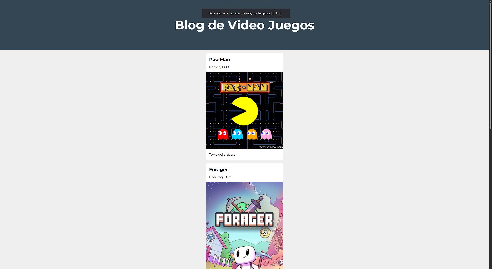

# 🎮 Blog de Videojuegos


## 📖 Descripción

Este proyecto es un **blog estático de videojuegos** creado con **HTML5** y **CSS3**, como parte de mi proceso de aprendizaje en desarrollo web.  

Incluye artículos sobre videojuegos clásicos y actuales, cada uno con su propia imagen, enlace a Wikipedia y breve reseña.  
El diseño está pensado para ser **atractivo, moderno y fácil de navegar**.

---

## 🚀 Características principales

- 🕹️ Artículos con títulos, imágenes y enlaces a Wikipedia  
- 🖼️ Imágenes adaptadas al contenido de cada juego  
- ✨ Animaciones y efectos de hover para mejorar la experiencia  
- 🎨 Tipografía moderna gracias a **Google Fonts (Montserrat)**  
- 📱 Diseño centrado y legible en distintas resoluciones  
- 🔗 Enlaces rápidos en el pie de página para volver arriba y contacto  

---

## 📂 Archivos del proyecto

- **index.html** → página principal con el contenido  
- **style.css** → hoja de estilos con tipografía, colores y animaciones  
- *(opcional)* carpeta `/img` → donde podrías guardar imágenes locales  

---

## 🖥️ Captura de pantalla

> *(Cuando quieras, sube una captura de tu web al repo y cámbiala aquí)*  
> ```markdown
> 
> ```

---

## 🛠️ Tecnologías utilizadas

- HTML5  
- CSS3  
- Google Fonts (*Montserrat*)  
- GitHub Pages *(opcional, para publicar la web online)*  

---

## 📦 Cómo probarlo en local

1. Clonar este repositorio:
   ```bash
   git clone https://github.com/Pablunito/Blog-de-Videojuegos.git
